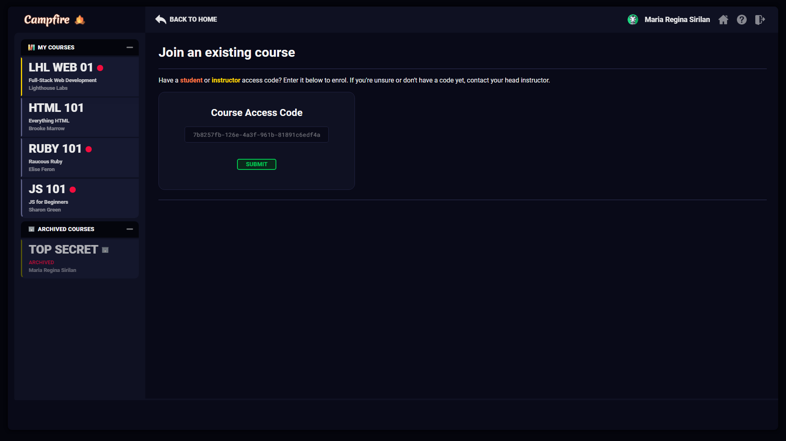

<!-- TITLE -->
<div align="center">

<h1>Campfire</h1>
<p>A Q&A discussion board for students
</p>

<p>Built with <a href="https://reactjs.org/">ReactJS</a>, <a href="https://nodejs.org/en/">Node.js</a>, <a href="https://expressjs.com/">Express</a>, <a href="https://www.postgresql.org/">PostgreSQL</a>, CSS</a>/<a href="https://sass-lang.com/">Sass</a>, and hosted with <a href="https://www.netlify.com/">Netlify</a> & <a href="https://www.heroku.com/">Heroku</a></p>

<b><a href="https://ahhreggi-campfire.netlify.app/" target="_blank">
   » View Live Demo «
</a></b>
</div>

<!-- INTRODUCTION -->

## 📚 Introduction

<b>[Campfire](https://ahhreggi-campfire.netlify.app/)</b> is a full-stack, single-page React application that allows users to enrol and participate in course Q&A discussion boards.

With millions of students now taking courses online due to the pandemic, it’s been harder for students to collaborate with their peers the way they would in-person within a classroom. Campfire addresses this problem by allowing users to easily discuss course-related questions with fellow students and instructors 24/7 in a controlled, moderated environment.

### 🤝 **Collaborators**:
- Maria Regina Sirilan ([**@ahhreggi**](https://github.com/ahhreggi))
- Mitchell Pizzacalla ([**@mpizzaca**](https://github.com/mpizzaca))
- Martin Halas ([**@mar10outof10**](https://github.com/mar10outof10))

This app was created as part of our final project for Lighthouse Labs - Web Development Bootcamp. The goal was to create a full-stack application from start to finish in just two weeks.

## ⚛️ Tech Usages

- <b>Frontend</b>: <a href="https://reactjs.org/">ReactJS</a>, CSS</a>/<a href="https://sass-lang.com/">Sass</a>
- <b>Backend</b>: <a href="https://nodejs.org/en/">Node.js</a>, <a href="https://expressjs.com/">Express</a>, <a href="https://www.postgresql.org/">PostgreSQL</a>
- <b>Tools & Testing</b>: <a href="https://storybook.js.org/">Storybook<a/>, <a href="https://jestjs.io/">Jest</a>, <a href="https://www.cypress.io/">Cypress</a>
- <b>Deployment</b>: <a href="https://www.netlify.com/">Netlify</a> (production client), <a href="https://www.heroku.com/">Heroku</a> (database API)

<!-- FEATURES -->
## ⭐ Features
- Users can create or join multiple courses via student/instructor access codes
- Users can create, edit, delete, and bookmark posts
- Users can mark their questions as resolved by selecting a "Best Answer"
- Users can upvote comments via a "like" button
- Instructors can endorse comments by "liking" them
- Instructors can edit/delete student contributions for moderation purposes
- Course owners can manage user roles/enrolment, and reset course access codes
- Course owners can mark a course as archived at the end of the term
- All users and courses can be modified by the authorized users upon creation
## ✨ Special Features:
   - Markdown support for 200+ languages
   - Dynamic search by keyword, user name, post title/body, comment body, or post ID (e.g., @123)
   - Additional filtering by user-generated, course-specific tags, including by resolved and unresolved status
   - Anonymous peer-to-peer contributions (visible only to instructors)
   - Engagement-based incentives to encourage student participation and collaboration
   - User management, course configuration, and instructor moderation tools
   - Profile customization


## 🛠 Installation

The project is live
<b><a href="https://ahhreggi-campfire.netlify.app/" target="_blank">here</a></b>, but if you would prefer a local installation:

1. Clone or download this repository
   ```
   git clone https://github.com/ahhreggi/campfire
   ```
2. Set up and run the campfire API server
   - See [README](https://github.com/ahhreggi/campfire-api)

5. Navigate to the project directory and install dependencies
   ```
   cd campfire
   npm install
   ```
6. Run the webpack development server
   ```
   npm start
   ```
7. Visit <a href="http://localhost:8000/">http://localhost:8000/</a> on your browser

## ✔️ Tools & Testing (Storybook, Jest, Cypress)

1. Run the Storybook visual testbed
   ```
   npm run storybook
   ```
2. Run the Jest test framework
   ```
   npm test
   ```
3. Run the Cypress test runner
   ```
   npm run cypress
   ```

## 📷 Screenshots





