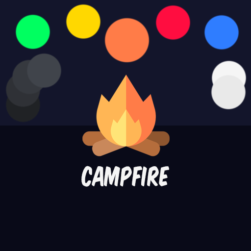

# Themes

## Palette (dark mode)

|                               Color                                | CSS Reference                              | Possible Usages                           |
| :----------------------------------------------------------------: | ------------------------------------------ | ----------------------------------------- |
|  `#ff7c48` | Orange                                     | primary                                   |
|  `#ff0d40` | Red                                        | accents, badges, buttons, danger          |
|  `#ffd800` | Yellow                                     | accents, badges, buttons, warning         |
|  `#00ff60` | Green                                      | badges, buttons, success                  |
|  `#2f7dff` | Blue                                       | badges, buttons, modified                 |
|  `#13152b` | Navy                                       | background, dark accent 1                 |
|  `#090a18` | Dark-Navy                                  | background, dark accent 2                 |
|  `#202225` | Grey-1                                     | background                                |
|  `#2f3136` | Grey-2                                     | background                                |
|  `#36393f` | Grey-3                                     | background                                |
|  `#40444b` | Grey-4                                     | background                                |
|  `#040404` | Dark                                       | text, shadows                             |
|  `#e9e9e9` | Light                                      | text, highlights                          |
|  `#f5f5f5` | Lighter/White                              | text, highlights                          |

## Palette Test Preview
